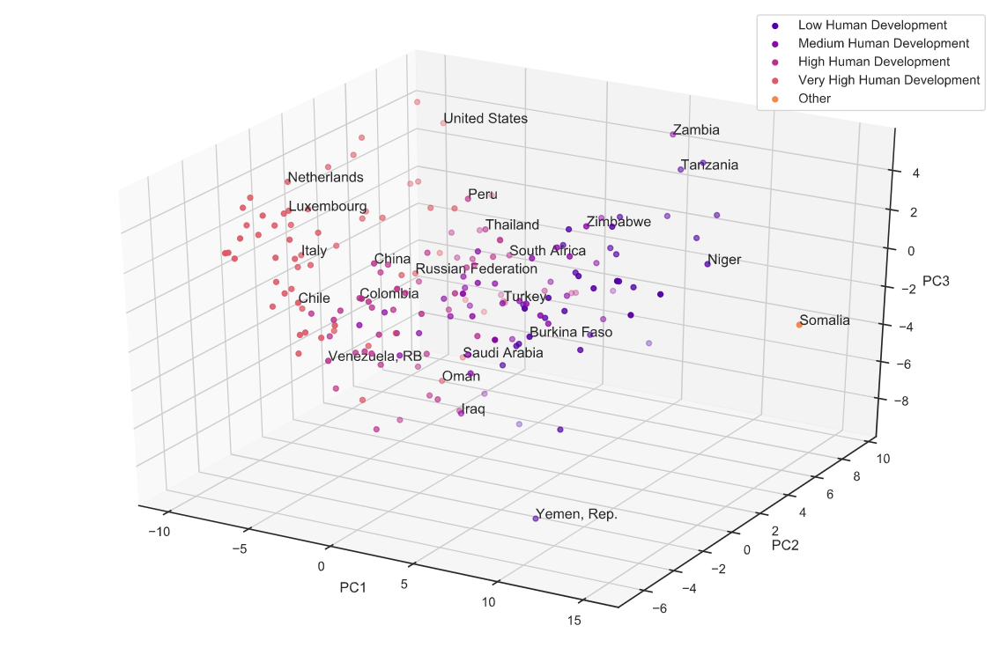
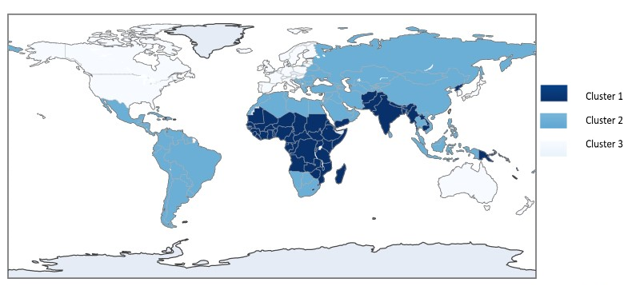
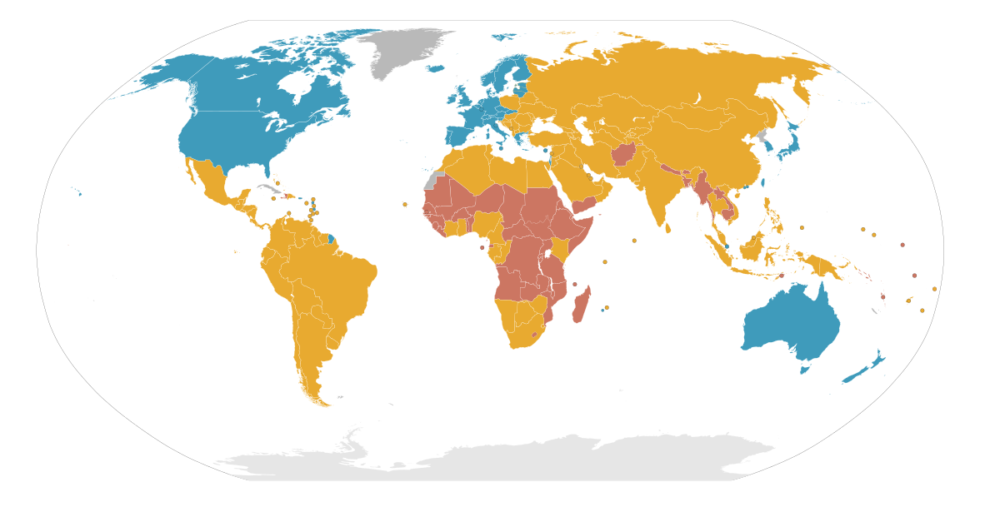

My motivation to study Mathematics together with Economics started in high school. Back then, I thought the way we were looking at our evolution was inherently false. We continuously measure the health of world economies by defining the change in added production value or Gross Domestic Product (GDP). I believed, and still do, that setting goals with that measure would not help us in the long term. 

Thus, when it was time to choose the subject of my thesis, I set out to make a world classification of the development of countries taking into account a broader view. This was primarily motivated by the fact that the Human Development Index only takes into account three measures (GDP, Life expectancy and Years of Education) to estimate the status of countries towards becoming a well-developed nation. However, development should entail a larger spectrum of considerations such as number of habitants living in poverty, prevalance of diseases among the population and their access to healthcare, the industrial impact on ecosystems, as well as the proper establishment and functioning of political and governmental entities. 

As such the following data was used to **cluster the countries in the year 2018**: 
- Human Development Report 2019 - [United Nations Development Programme](https://hdr.undp.org/content/human-development-report-2019) (UNDP)
- World Development Indicators - [World Bank](https://databank.worldbank.org/source/world-development-indicators) 
- Democracy Index Report 2018 - [The Economist Intelligence Unit](https://www.eiu.com/n/campaigns/democracy-index-2018/)
- Environmental Performance Index 2018 - [Columbia University and Yale University](https://epi.yale.edu/downloads/epi2018policymakerssummaryv01.pdf)

Now, there is a lot of data missing for some regions of the world and, while one could have relied on techniques to fill in missing values, I prefered to leave the data intact and reduce the dimension using **Probabilistic Principal Component Analysis (PPCA)** which works on missing data and serves to counter the curse of dimensionality and dealing with large distances in the high-dimensional space (149 variables). The resulting dimension was arbitrarily decided to be 3, similarly to the number of variables used in the HDI. This process resulted in the fololowing three dimensional space where we can see that the classification of the UNDP is relatively well preserved while still being somewhat different: 

Finally, the values per countries were clustered using methods to select the number of clusters definedd by K-means, Spectral Clustering and Agglomerative Hierarchical Clustering. The last method yielded the most interesting results, being very similar to the development classification by the International Monetary Fund. 

Here we see that more African countries are clustered together (cluster 1) than the least developed category of the IMF, Eastern European nations are more likely to be considered similar the most developed countries (cluster 3). At last, it is possible to cluster countries which do not have a lot of data available for the international organisation to analyse their state of development like Cuba or North Korea 

For more information, [see the full research project](https://thesis.eur.nl/pub/53499/Thesis_Bsc2_FinalDraft_LaraMalinov_449285.pdf)