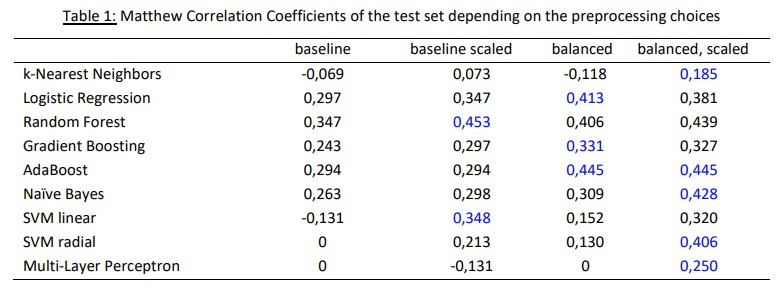
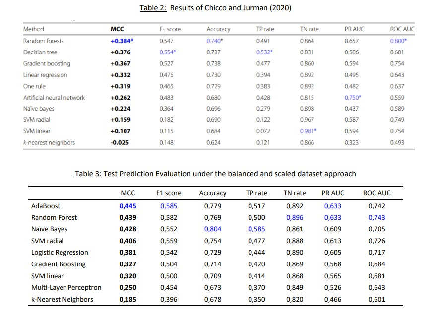

### The importance of preprocessing techniques on modelability

The healthcare domain is one that can and will greatly benefit from machine learning techniques. However, being both an expert in AI and having a healthcare or medecine background is not easy as both disciplines require a lot of years of study. Thus, I would like to argue the case that both domains need to combine efforts to make groundbreaking research and usable products. 
I found [this research](https://bmcmedinformdecismak.biomedcentral.com/articles/10.1186/s12911-020-1023-5?ref=https://githubhelp.com) (Chicco and Jurman, 2020) that applied multiple models to predict the survival of patients with left ventricular systolic dysfunction collected by the Faisalbab Institute of Cardiology and the Allied Hospital in Faisalabad in Punjab, Pakistan. Yet, two problems arise in this research: 
- the dataset consist of only 299 patients among which 96 who died. In making the training, validation and testing sets, the imbalance was not taken into account. 
- features were not scaled and thus distance based methods such as Support Vector Machines (SVM) or k-Nearest Neighbors (kNN) were improperly executed. When I replicated the research, SVM with radial basis function and the Multi-Layer Perceptron (MLP) even failed to converge and yield a usable model. 

Therefore, the aim of my research was to show the extend to why these considerations are important. In that regard, the baseline selects 80% at random, the balance set approach only takes 100 observations to train them model, 50 of each class, and, in the scaling case, features are standardized.

The results show that both choices of balancing the data and scaling the features lead to better test results event when significantly less observations are used for training (100 vs 239 in Chicco and Jurman, 2020).

<object data="../assets/images/ML Poster.pdf" type="application/pdf" width="750px" height="500px">
</object>

