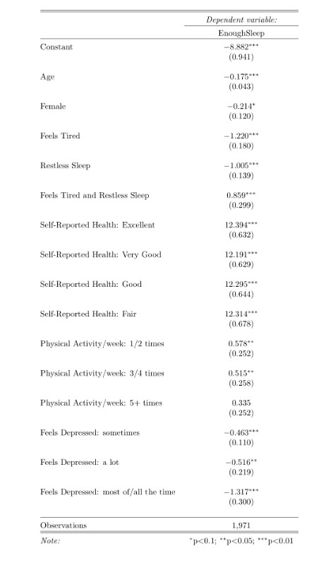

This was a small research I conducted for my course in Health and Medical Analytics. I was inspired by the book "Why we sleep?" by Matthew Walker who wrote that when if individuals who don't sleep enough don't realise it and are more likely to suggest they sleep enough. 

The data used in the analysis is from the AddHealth Survey data of Wave II collected between April  and  August  1996.  The  focus  of  the  study is  on  adolescents  aged  13  to  18  years  who responded that they sleep less than the minimum recommended sleeping duration of 8 hours. The aim is to see what factors are correlated with the fact that adolescent with insufficient sleep think they get enough sleep. 

The results suggest that : 
- the more an adolescent exercises per week the less likely they will say they sleep enough. 
- The more they experience feelings of depression the more they will admit they don't sleep enough. 
- an adolescent that feels tired will more likely ackowledge that they don't sleep enough compared to one that experiences restless sleep
- an adolescent with both restless sleep and feelings of tiredness is more likely to answer that they don't sleep enough 
- adolescents with more modest answers on self-reported health are less likely to say they get enough sleep compared to report excellent self-reported health
- feamles are less likely to say they get enough sleep although the variables is only significant at the 10% significance level.

Other variables were considered such as grade in biolody, fast food meals per week, screentime etc. but these were dropped one at a time following the regression results.

 