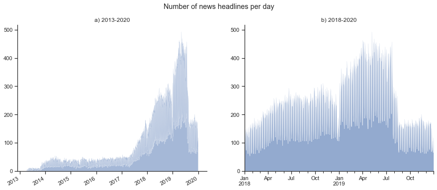
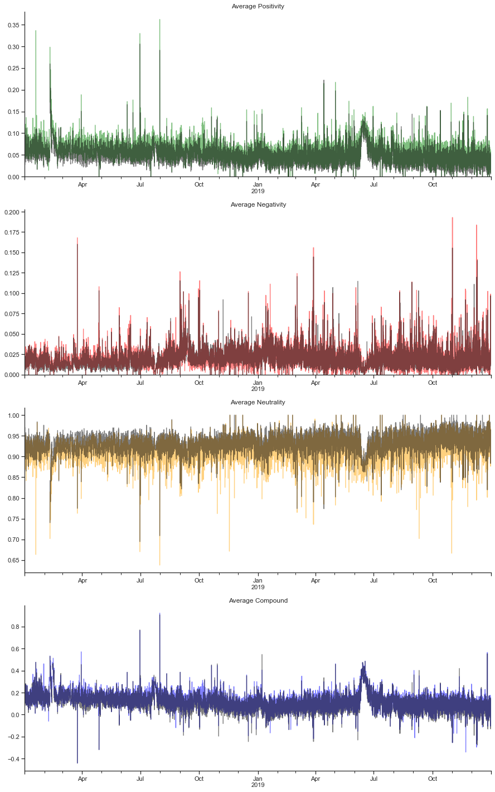
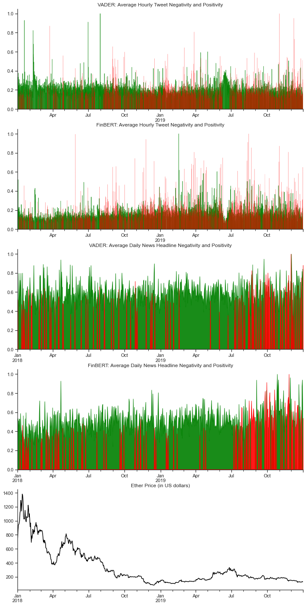

Following the course CS234 Reinforcement Learning at Stanford University, I wanted to apply the methods in a trading context namely of Ethers powering the Ethereum blockchain. The choice was motivated by the fact that cryptocurrencies have been gaining a lot of attention in the past years and Ethereum, in comparison to Bitcoin, is powering multiple services and can be viewed more as a commodity rather than simply a mean of exchange. Furthermore, to my limited knowledge, it seems the large fluctuations in price are partly driven by the community and the public buzz, rather than tangible reasons the cryptocurrency can be used. Thus, I wanted to explore how using news headlines or tweets would change the trading performance compared to using solely the price or technical indicators as inputs to the model. 

To that end, I scrapped off tweets mentioning "Ethereum" or "ETH" and used the dataset, created by BDC Consulting, of cryptonews headlines from 2013 to 2019. The majority of headlines were collected from 2018 to 2019, thus this is the timeframe that is considered in the research and consequently aorund 1,000 tweets are gathered for each day, amounting to 724,022 over the course of the two years. The tweets were cleaned off mentions, urls, hashtags and emojis etc. and as a result the sentiment polarity is more extreme as shown on the following figure using the VADER sentiment classifier. 

 

Next, I chose to investigate what would be better between using sentiment classifiers (VADER and FinBERT) and sentence embeddings (USE and SentenceBERT) on the text inputs. 

 

The RL method of choice was the A2C algorithm (Asynchronous Actor-Critic) to not extend further the scope of the research and limit it to combination of data and feature creation. Both actor and critic are modeled using LSTM networks and for the price and extracted sentiment datasets a Multi-Layer Perceptron is used prior as a feature extractor, while a convolutional layers are used on the sentence embeddings. For each hour of the day the last 50 tweets or news headlines are used as inputs to the the model. 

The results show that for news headlines the VADER sentiment classifier and the SentenceBert embedding perform best. For tweets, the sentiment extractors perform better than the sentence embeddings. 

Finally, the best sentiment classifier and sentence enbedding models for both tweets and news headlines are compared against trading solely the price and technical indicators used for stock analysis. Overall, using only the price as input performs best, the news headlines are better than tweets but using SentenceBERT on news headlines is the most promising as it recovers the most from its previous losses and makes the highest return compared to its lowest balance. 

