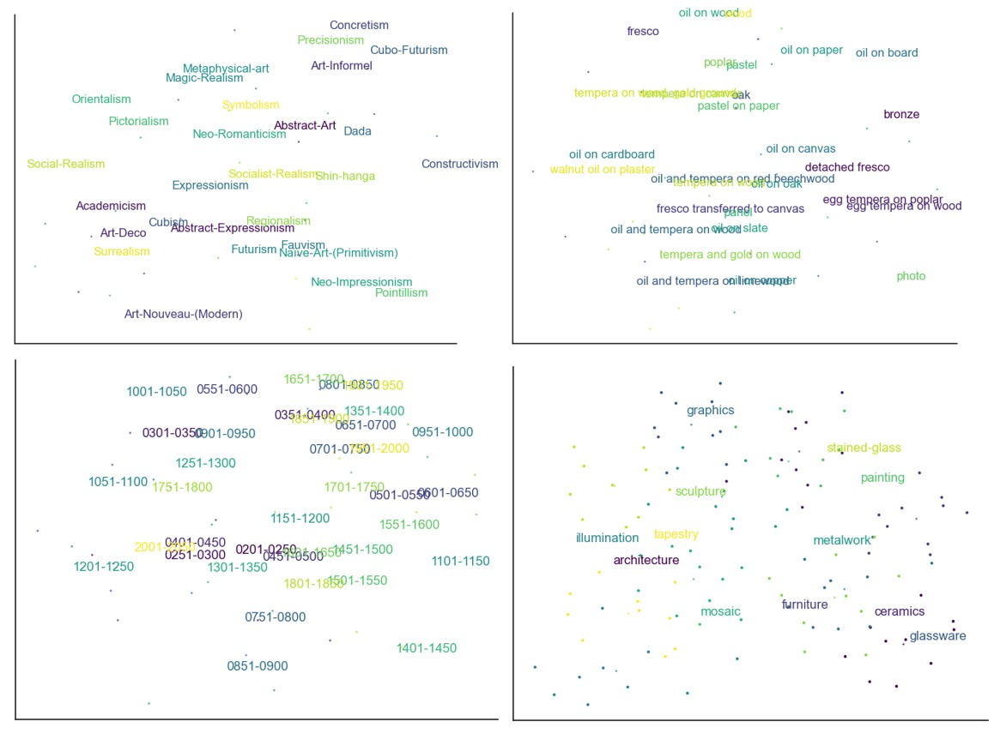

How to make models that are invariable to the number of classes or features? Prototypical networks are an option I wanted to explore in the context of art analysis. The world of art is one that is constantly being expanded by creative minds but when looking at art datasets they all have different features but none contains it all. This research explores the use of prototypical networks for few-shot in-context learning that could potentially be used with minhash techniques to enrich art databases.

The method uses k images for each of the n classes to create an embedding, the prototype, that can later be matched to classify the held-out k+1 image by computing the closest distance to the prototypes and assigning the label with the minimum distance. 

In this experiment, the Web Gallery of Art and WikiArt databases are used as they both contained either a large amount of data or a large amount of features. 

The best models were usually obtained for 2-way 5-shot models with 5 convolutional layers and 32 channels and accross all features the more there are labels the lower was the performance. 

The best performance was achieved for the type feature. Here are some prototypes in their two dimensional representation via t-SNE (art types, styles between 1901-1950, painting techniques and timeframes). 

Check out the poster.

<object data="../assets/images/Project Poster MTML.pdf" type="application/pdf" width="750px" height="500px">
</object>

