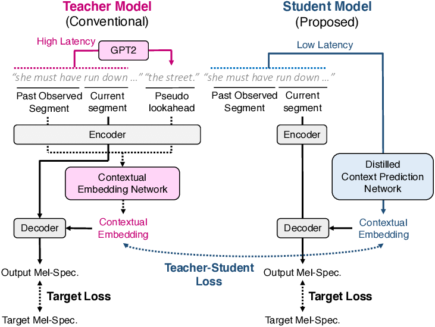

The research is motivated by the recent breakthroughs in Large Language Models pioneered by OpenAI and their release of ChatGPT and later on GPT-4. We have seen first hand how the way we work, search and inform ourselves will be impacted in the future. While OpenAI has not released the specifics of how they trained their models, one thing is sure is that they are *very* large and processed *a lot* of data. In the last decade, most records on benchmarks are due to increasing the size of the models. ChatGPT has around 175 billion parameters and GPT-4 has close to 100 trillion but, with the risks of climate change, concerns and awareness are on the rise in academic circles regarding the training and deployment of AI models. It is estimated that 25 tCO2eq a day are emited every day by the global use of ChatGPT, which is roughly twice the yearly carbon footprint of the average American. As such, more efforts are required in designing novel archictectures and mechanisms that don't necessarily require more parameters. Another aspect that is gaining more traction is data quality assurance, which I first heard in a course from Andrew Ng. Deep learning models are feeding off millions of data observations and it is hard to monitor and control all the information they contain. However, when model hyperparameters don't  offer much improvement in performance metrics, one could go back in refining the data at hand. With respect to language models, what makes them powerful is clean, rich, and diverse data which in turn will make them adept at solving various tasks in different domains. 

With that in mind, I set out to multi-task train a small language model, DistilGPT, on different tasks from the Beyond the Imitation Game benchmark (BIG-bench) together with sampling and surgical finetuning techniques in order to find out **how to make a model better a tasks it wasn't trained on without increasing the number of parameters**. 

###  Model 
DistilGPT is a model that has been trained to imitate GPT-2 in a teacher-student fashion. It is both trained to minimize the error against the true label and the error with the prediction of GPT-2, the teacher model.

### Techniques
From the selected tasks, **three sampling procedures** are employed: 
- Base case: all observations are used and are unweighted 
- Task weighted: all tasks have equal representatio or weight, during training. This is to ensure that the model does not prioritize one task over others. 
- Domain weighted: each task in BIG-Bench have keywords associated to them such as social reasoning, common sense etc. Thus, the model is trained to be equally good in all disciplines/ domains/ keywords.
Making the datasets is done by up- and down-sampling the observations. 

For **surgical finetuning**, different layers and/or transformers block are trained at every epoch, 20 in total :
- All the model parameters are trained 
- Last Linear layer
- First Block (0)
- Middle Block (2)
- Last Block (5)
- Cascade fashion: blocks are trained one after the other over the course of training 
- Reverse Cascade: blocks are trained from the downstream to upstream. 

*Linear layer is trainable in all experiments during all epochs.

### Data and Experiment Design 
BIG-bench were initially run on GPT-2 and narrowed down to a selection of tasks where model inference did not result in a error on the task at hand. Furthermore, the Apriori Frequent Itemset algorithm was applied on the keywords of the tasks to select the most common keywords and keywords combination. This is to ensure that there is no overlap between the training and testing tasks domains. The procedure resulted in 26 training tasks (around 10,000 obs.) and 6 evaluation tasks (around 4,000 obs.). From the the training tasks, 707 observations are held out to get insights at inference into what the model had learned. Validation and Testing are constructed by a 25%-75% split of the held-out training observations and the evaluation tasks observations. 

### Result
The results show that :
- the lowest loss is generally achieved by the cascade finetuning techniques 
- as the training loss decreases the performance on the test set does not necessarily improves. Only the models trained by finetuning the last linear layer shows knowledge transfer from training tasks to test tasks and unexpectedly peaks after 5 epoch. 
- Task weighting the training observations reaches the best scores on the held-out training observations
- Domain weighting reaches the highest performance than task weighting on the evaluation tasks but the choice of task- vs. domain- weighting depends the fine-tuning technique as well and is thus inconclusive
- Compared to the untrained DistilGPT-2 the performance on evaluation tasks increased by a factor of 10 all while being trained on different tasks

When analysing the best model trained without sampling procedure and by fine-tuning the last linear layer, the results show that the model learned best on tasks related to logical reasoning and mathematics as well as numerical response and contextual question-answering. On the evaluation tasks, the model performs best on the combination of emotional intellgence and emotional understanding, more specifically the "suicide risk" dataset of BIG-bench. This represents an unusual finding as the domain transfer from the logical realm to an emotional discipline was not expected to be achievable but it also suggest that there is an overlap in tasks that we wouldn't directly think of. 

 and testing (in blue) keyword pairs")

Check out the poster. 

<object data="../assets/images/Project Poster.pdf" type="application/pdf" width="750px" height="500px">
</object>

